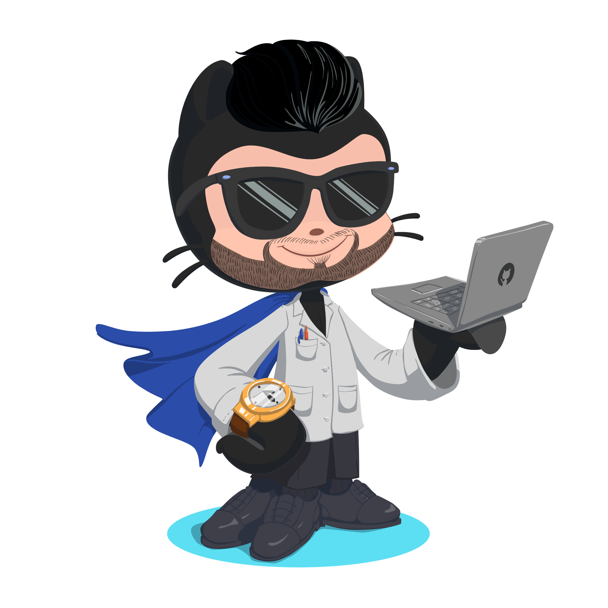

<!--
    Hello World, I'm Lahiru Madhuka!
    This is my README code
-->

    

 

<!-- About Me -->

I'm a Software Engineering undergraduate based in Sri Lanka, passionate about full-stack development and Artificial Intelligence, and interested in building practical software solutions for real-world problems.

<!-- Socials -->
<h1>🌐 Socials</h1>

    

<!-- Tech Stack -->
<h1>💻 Tech Stack</h1>

    

<h2>💻 Programming Languages</h2>

<h2>🎨 Frontend Development</h2>

<h2>⚙️ Backend Development</h2>

  
  
  

<h2>🗄️ Databases</h2>

<h2>📱 Mobile Development</h2>

<h2>🌐 CMS & Web Platforms</h2>

<h2>🔧 Tools & DevOps</h2>

  
  
  

<h2>🎨 Design & Creative Tools</h2>

<!-- Random Dev Quote -->
<h1>✍️ Random Dev Quote</h1>

&nbsp;

<!-- My Contributions -->
<h1>🟩 My Contributions</h1>

  

Thanks for visiting my profile! 👋

⭐ Feel free to explore my repositories and projects!

